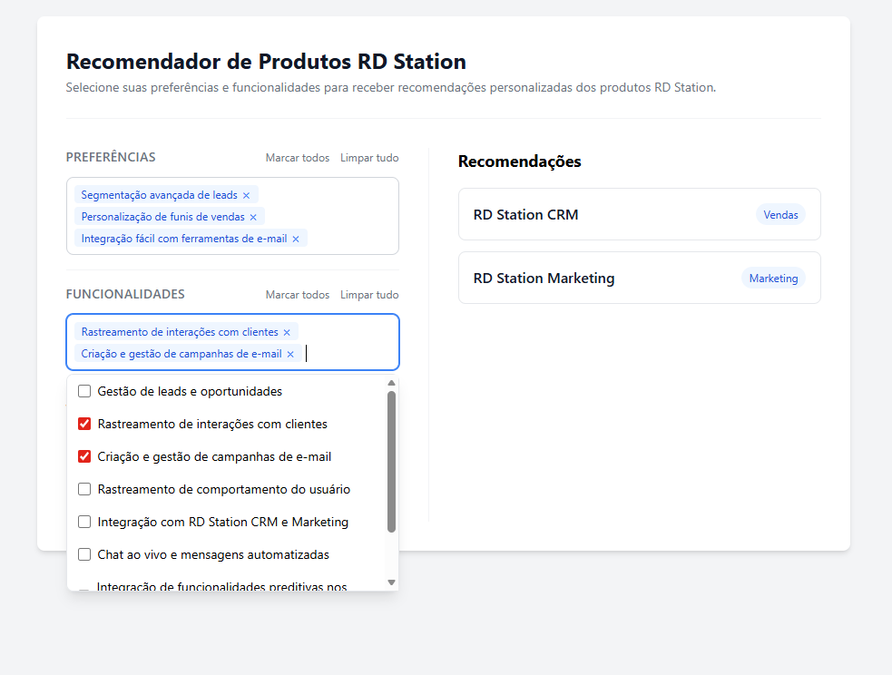
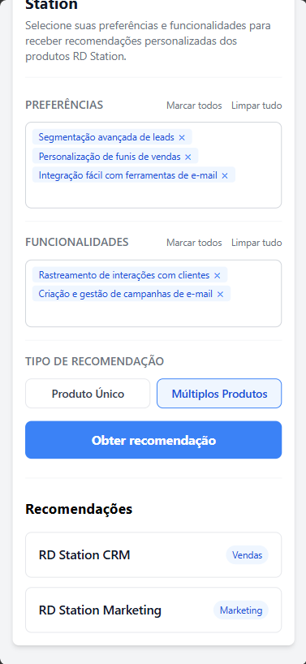

# Recomendador de Produtos RD Station

Aplicação React que recomenda produtos da RD Station com base nas preferências e funcionalidades selecionadas pelo usuário em um formulário interativo.

## Preview

| Desktop | Mobile |
|:---:|:---:|
|  |  |

## Funcionalidades

- Recomendação em modo **SingleProduct** (produto com maior pontuação; último em caso de empate) e **MultipleProducts** (todos com ao menos 1 ponto)
- Campo de seleção com **autocomplete e tags** — busca por texto, adiciona/remove itens com mouse ou teclado, sem dependências externas
- Atalhos **"Marcar todos"** e **"Limpar tudo"** em Preferências e Funcionalidades
- Feedback de **loading** (botão desabilitado + texto alternativo enquanto a API carrega) e **error** (mensagem visível se a API falhar)
- Layout **responsivo**: duas colunas no desktop, empilhado no mobile

## Tecnologias

- React 18
- Tailwind CSS 3
- json-server (mock REST API)
- Lerna 8 (monorepo)
- Jest + React Testing Library

## Como executar

### Pré-requisito

Node.js >= 18.3. Para instalar com `nvm`:

```bash
nvm install 18.3
nvm use 18.3
```

Ou com `n`:

```bash
npm install -g n
n 18.3
```

### Passos

```bash
# 1. Instalar dependências
yarn install

# 2. Iniciar frontend e backend simultaneamente
yarn dev
```

- Frontend: http://localhost:3000
- Backend (mock API): http://localhost:3001

### Scripts disponíveis

| Script | Descrição |
|---|---|
| `yarn dev` | Inicia frontend + backend juntos |
| `yarn start:frontend` | Somente a aplicação React |
| `yarn start:backend` | Somente o json-server |
| `yarn workspace frontend test` | Executa os testes |

## Testes

25 testes em 4 suites, todos passando:

| Suite | Testes |
|---|---|
| `recommendation.service` | 7 — cobre SingleProduct, MultipleProducts, tie-break, nenhuma seleção, sem correspondência, match apenas em features |
| `Preferences` | 4 — "Marcar todos" e "Limpar tudo" via callback e via DOM |
| `Features` | 4 — espelho dos testes de Preferences |
| `MultiSelectAutocomplete` | 10 — placeholder, abertura, filtro, estado vazio, seleção, tags, remoção, Backspace, Escape, Enter |

```bash
yarn workspace frontend test
```

## Arquitetura

`App.js` orquestra o estado: chama `useProducts` (fetch + loading/error) e `useRecommendations` (estado das recomendações + `submitForm`), depois injeta tudo como props no `Form`. O `Form` é puramente apresentacional — coleta entrada via `useForm` e delega ao `onSubmit` recebido via prop.

`recommendation.service.js` usa um mapa de estratégias (`strategies`) para calcular SingleProduct ou MultipleProducts — adicionar um novo tipo exige apenas uma nova entrada no objeto, sem modificar a lógica existente.

```
App
├── useProducts       → busca API, expõe preferences, features, products, loading, error
├── useRecommendations → expõe recommendations e submitForm(formData)
├── Form              → coleta entrada, chama onSubmit(formData)
│   ├── Preferences / Features  → MultiSelectAutocomplete (custom, sem libs)
│   └── RecommendationType      → pill-buttons SingleProduct / MultipleProducts
└── RecommendationList → exibe os produtos retornados
```

## Critérios de aceite

- [x] Receber preferências do usuário via formulário
- [x] Retornar recomendações baseadas nas preferências
- [x] Modo SingleProduct: retornar o produto com maior pontuação
- [x] Modo MultipleProducts: retornar lista de produtos com ao menos 1 ponto
- [x] Em caso de empate, retornar o último produto válido
- [x] Lidar com diferentes tipos de preferências e funcionalidades
- [x] Serviço modular e extensível (strategies map, desacoplado da UI)

## Autor

Lucas Gomes

## Licença

Este projeto está licenciado sob a [Licença MIT](LICENSE).
